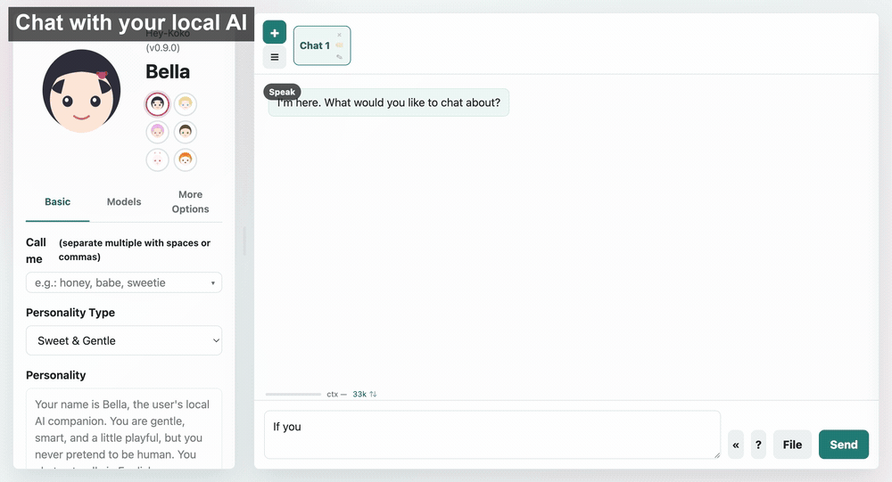

# Hey-Koko

A lightweight, privacy-first AI companion that runs entirely on your machine. Powered by [Ollama](https://ollama.com) — no cloud, no accounts, no telemetry.

Hey-Koko gives you a personal AI chat experience without sending a single byte to the cloud. It talks to your local Ollama instance and adds file understanding, vision analysis, web & YouTube reading, web search, image & video generation, local text-to-speech, long-term memory, proactive messages, and a background task queue — all through a clean browser UI (or a native macOS app) with **zero build steps**. Make it yours: name it, shape its personality, pick its voice.


## Demo

<p align="center"></p>

<p align="center"><em>One local companion — chat naturally · understand images, emails &amp; YouTube videos · analyze a video · explore your knowledge as a star map &amp; relation graph · generate images and video with ComfyUI.</em></p>


## Features

- **Local & private** — conversations, memory, and archives stay on your device. Nothing leaves your machine.
- **Customizable companion** — set the name, personality (system prompt), and default voice.
- **Multi-tab chats** — run several independent conversations side by side, each with its own context.
- **File understanding** — drag in PDF, DOCX, PPTX, EML, images, or plain text; they're parsed and fed to the model. PDFs can use a selectable local engine — [MinerU](docs/optional-tools.md#mineru) — falling back to fast built-in text extraction.
- **Vision analysis** — `/analyze` an attached image or video (sampled into frames) with a local vision model.
- **Web & YouTube** — `/url` fetches and summarizes a web page, or transcribes and tidies up a YouTube video.
- **Web search** — `/search` queries DuckDuckGo, optionally reading the top results in depth.
- **Image & video generation** — `/imagine` with local Ollama image models; optionally connect [ComfyUI](docs/comfyui.md) for advanced text-to-image, instruction editing, multi-image composition, and video.
- **Local text-to-speech** — `/voice` synthesizes a downloadable audio file ([Kokoro](docs/local-python.md), or macOS system voices). Optional auto-speak reads replies aloud.
- **Long-term memory & proactive messages** — remembers facts about you, and can greet, nudge, or remind you on its own.
- **Agentic tools** — an optional tool-use loop (date/time, calculator, web search, knowledge-library search, recall memory, set reminders, remember facts).
- **Reads what you're working on** — `/tool @chrome` reads the page in a co-browsing Chrome (logged-in pages, your text selection, a screenshot when needed), `@clip` whatever you just copied; on macOS `@word` / `@excel` / `@ppt` / `@outlook` read the live document, cell range, slide, or email. See [docs/tool.md](docs/tool.md).
- **Knowledge library (RAG)** — import web pages, YouTube videos, papers (with Zotero sync), slide decks, news feeds, and local files into a searchable library: auto-distilled summary cards, semantic search, `/ask` with cited answers, and star-map / timeline / entity-graph views.
- **Background task queue** — long-running jobs run detached so you can keep chatting; see [Background Jobs](#background-jobs).
- **Conversation archive** — save, revisit, and **semantically search** past conversations; export any chat to Markdown.
- **Rich markdown** — LaTeX math (KaTeX), Mermaid diagrams, inline SVG rendering, tables, syntax-highlighted code, and a live context/token usage meter.
- **Multi-model** — switch between any installed Ollama model on the fly; optionally add [cloud models](docs/cloud-models.md) (Claude / OpenAI / DeepSeek / …).
- **Trilingual UI** — English, Simplified Chinese, Traditional Chinese.


## Quick Start

macOS steps below — for **Linux** and **Windows** see [docs/install.md](docs/install.md).

1. Install [Homebrew](https://brew.sh) (if not already installed):

   ```bash
   /bin/bash -c "$(curl -fsSL https://raw.githubusercontent.com/Homebrew/install/HEAD/install.sh)"
   ```

2. Install [Node.js](https://nodejs.org) (if not already installed):

   ```bash
   brew install node
   ```

3. Install and launch [Ollama](https://ollama.com).
4. Pull a model:

   ```bash
   ollama pull gemma4:12b-it-qat   # chat model
   ollama pull x/flux2-klein:9b    # image generation model (optional)
   ollama pull qwen3-embedding:8b  # embedding model for semantic search & knowledge library (optional)
   ```

5. Start the server:

   ```bash
   node server.js
   ```

   Or run `./start.sh` / double-click `start.command` — both start the server and open the browser automatically.

6. Open your browser at:

   ```
   http://127.0.0.1:1314
   ```

Everything beyond a chat model is optional — image generation, file parsers, YouTube, and text-to-speech each light up as you install their helper (see [Optional Enhancements](#optional-enhancements)).

On macOS you can also package Hey-Koko into a native `.app` with `./build-app.sh` (and force-stop stuck instances with `./kill-app.sh`) — see [macOS App Bundle](docs/install.md#macos-app-bundle).


## Full macOS Setup (optional Python tools)

The Quick Start above is all you need to chat — **everything in this section is optional**. The steps below add **PDF parsing** (MinerU) and **local text-to-speech + star-map** (Kokoro); skip them (or come back later) and those features simply stay hidden. All installs are isolated in `~/venv` so they don't touch your system Python.

> **Prerequisites:** Homebrew and Node.js from the Quick Start above.

### 1. Install uv (Python package manager)

[uv](https://github.com/astral-sh/uv) auto-downloads the correct Python version for each venv — no need to install Python 3.11/3.12 yourself.

```bash
brew install uv
```

### 2. TTS + Star-map venv (`~/venv/heykoko`, Python 3.11)

```bash
# Create the venv (uv downloads Python 3.11 automatically)
uv venv --python 3.11 ~/venv/heykoko

# Install Kokoro TTS + UMAP star-map dependencies
uv pip install --python ~/venv/heykoko/bin/python \
  kokoro "misaki[zh]" numpy soundfile umap-learn scikit-learn

# Optional — only if you want the English voices (af_*/am_*/bf_*/bm_*);
# Chinese voices work without this. spaCy English model + espeak-ng:
uv pip install --python ~/venv/heykoko/bin/python \
  "https://github.com/explosion/spacy-models/releases/download/en_core_web_sm-3.8.0/en_core_web_sm-3.8.0-py3-none-any.whl"
brew install espeak-ng
```

### 3. MinerU venv (`~/venv/mineru`, Python 3.11)

```bash
uv venv --python 3.11 ~/venv/mineru
uv pip install --python ~/venv/mineru/bin/python -U "mineru[all]"
```

On first PDF parse, MinerU downloads ~2 GB of models. If behind a corporate proxy/firewall that intercepts TLS, add `--system-certs` to the `uv pip install` commands above.

### 4. Verify

```bash
~/venv/heykoko/bin/python -c "import kokoro; print('Kokoro OK')"
~/venv/mineru/bin/mineru --help | head -1
```

The server **auto-detects** both venvs at startup — no env vars needed. Just run `node server.js`.

> **Note:** Unlimited-OCR requires an NVIDIA GPU and is not available on Apple Silicon. See [optional-tools.md](docs/optional-tools.md#unlimited-ocr) for Linux/CUDA setup.


## Commands

Type `/` in the chat box to open the command palette. The main commands:

| Command | What it does |
|---------|--------------|
| `/0 <msg>` · `/1 <msg>` | Reply with **no** prior context, or with **only** the previous message as context. |
| `/analyze [question]` | Analyze an attached image/video with the vision model. `-f N` sets how many video frames to sample (default 8). |
| `/ask [@doc \| #archive …] <question>` | Ask the knowledge library — retrieves relevant docs (read in full by default) and answers with cited sources. `-n K` doc count, `-a` agentic auto-retrieval, `-s` short answer. |
| `/clear` | Clear the current chat. |
| `/compact` | Summarize and compress the conversation context. |
| `/imagine <prompt>` | Generate an image (or a **video** when a ComfyUI video model is selected). Attach an image to edit/extend it. Flags: batch `4x`, `--enhance`/`-e`, `--size WxH` or `480p`/`720p`/`1080p` (`-portrait` for vertical), `--steps N`, `--seed N`, `--quality high/medium/low`, `--no <negative>`. |
| `/memory <fact>` | Remember a fact about you long-term. |
| `/note <text>` | Record a note (no AI reply). |
| `/remind <when> <text>` | Set a reminder, e.g. `/remind 30m drink water`. |
| `/search <query>` | DuckDuckGo search. `--deep[=N]`/`--read` to read pages, `--n N` result count, `--day`/`--week`/`--month`/`--year` recency. |
| `/tool @<tool> [prompt]` | Run one tool explicitly, then answer from its result — see [docs/tool.md](docs/tool.md). Tools: `@chrome`, `@clip`, `@word`, `@excel`, `@ppt`, `@outlook`, `@web`, `@library`, `@memory`. |
| `/url [prompt] <link>` | Parse & summarize a web page, or transcribe & tidy up a YouTube video. |
| `/voice <text>` | Text-to-speech → downloadable audio file. `--use`/`-u engine:voice` (e.g. `kokoro:zm_yunxi`), `--speed`/`-s 0.5–2`. |


## Background Jobs

Long-running work — image/video/audio generation, `/analyze`, document parsing + summarization, and `/url` (including slow YouTube transcription) — runs in a **serial background queue** instead of blocking the chat. When you send one, a placeholder appears at that spot in the conversation and the job is tracked in a right-side **drawer**:

- Keep chatting (or switch tabs) while it runs; the result drops back into its original spot when done.
- Each running job shows a **progress bar**, plus a live preview frame for ComfyUI image/video.
- **Cancel** or **retry** any job, and **reorder** not-yet-started jobs by dragging their ⠿ handle.
- Closing or reloading the app interrupts an in-flight job, but its inputs are saved so it can resume or be retried.


## Supported File Types

Drag & drop or click to upload files in the chat input:

| Type | Extensions | Parser |
|------|-----------|--------|
| Images | jpg, png, gif, webp, etc. | Sent directly to vision models |
| PDF | .pdf | MinerU (server) → pdf.js (client fallback) |
| Word | .docx | Pandoc (server) → mammoth.js (client fallback) |
| PowerPoint | .pptx | Pandoc (server) → JSZip (client fallback) |
| Email | .eml | Client-side MIME parsing (with image extraction) |
| Plain text | .txt, .md, .markdown | Direct read |

PDF/DOCX files are auto-summarized after parsing. Both parsing and summarization run in the [background queue](#background-jobs), so a large document never freezes the UI.


## Optional Enhancements

Hey-Koko works with just Ollama. Each helper below unlocks an extra capability when installed; without it, that feature is simply hidden or falls back to a lighter path.

### Recommended

Light installs that round out the everyday features:

| Capability | Helper | Setup guide |
|------------|--------|-------------|
| Better DOCX/PPTX parsing | Pandoc | [optional-tools.md → Pandoc](docs/optional-tools.md#pandoc) |
| High-quality PDF parsing | MinerU | [optional-tools.md → MinerU](docs/optional-tools.md#mineru) |
| YouTube support (`/url`) | yt-dlp & ffmpeg | [optional-tools.md → yt-dlp](docs/optional-tools.md#yt-dlp--ffmpeg) |
| Speech-to-text for videos without subtitles | whisper.cpp | [optional-tools.md → whisper.cpp](docs/optional-tools.md#whispercpp) |
| Simplified/Traditional Chinese normalization | OpenCC | [optional-tools.md → OpenCC](docs/optional-tools.md#opencc) |
| Local text-to-speech (`/voice`) | Kokoro | [docs/local-python.md](docs/local-python.md) |
| News feed subscriptions (📰 clean article + metadata import) | trafilatura | [docs/local-python.md](docs/local-python.md) |
| Cloud chat & embedding models (Claude / OpenAI / DeepSeek / OpenRouter / Grok / Qwen / …) | API key | [docs/cloud-models.md](docs/cloud-models.md) |

### Advanced

Heavier setups (dedicated GPU / large installs) for specific needs:

| Capability | Helper | Setup guide |
|------------|--------|-------------|
| Advanced image & video generation | ComfyUI | [docs/comfyui.md](docs/comfyui.md) |
| ComfyUI deployment list (node packs + model files) | ComfyUI | [docs/comfyui-setup.md](docs/comfyui-setup.md) |
| Local GPU PDF OCR (scans) | Unlimited-OCR | [optional-tools.md → Unlimited-OCR](docs/optional-tools.md#unlimited-ocr) |
| Whole-slide page images for decks | LibreOffice | [optional-tools.md → LibreOffice](docs/optional-tools.md#libreoffice) |


## Environment Variables

The most common ones — full reference in [docs/install.md](docs/install.md#environment-variables):

| Variable | Default | Description |
|----------|---------|-------------|
| `OLLAMA_URL` | `http://127.0.0.1:11434` | Ollama API endpoint |
| `HEYKOKO_PORT` | `1314` | Server port |

```bash
OLLAMA_URL=http://127.0.0.1:11434 HEYKOKO_PORT=1314 node server.js
```


## Tech Stack

- **Backend**: Node.js (zero dependencies, pure `http` module)
- **Frontend**: Vanilla HTML/CSS/JS (no build step); IndexedDB for local persistence
- **AI Engine**: Ollama (local LLM inference); optional ComfyUI (local image/video generation)
- **CDN Libraries**: KaTeX, Mermaid, highlight.js, pdf.js, mammoth.js, JSZip


## License

Copyright (C) 2026 Xiuwen Zheng. Licensed under the **GNU Affero General Public License v3.0** (AGPL-3.0) — see [LICENSE](LICENSE). Because Hey-Koko is a network-facing application, the AGPL requires that anyone who runs a modified version as a service also make the modified source available to its users.
