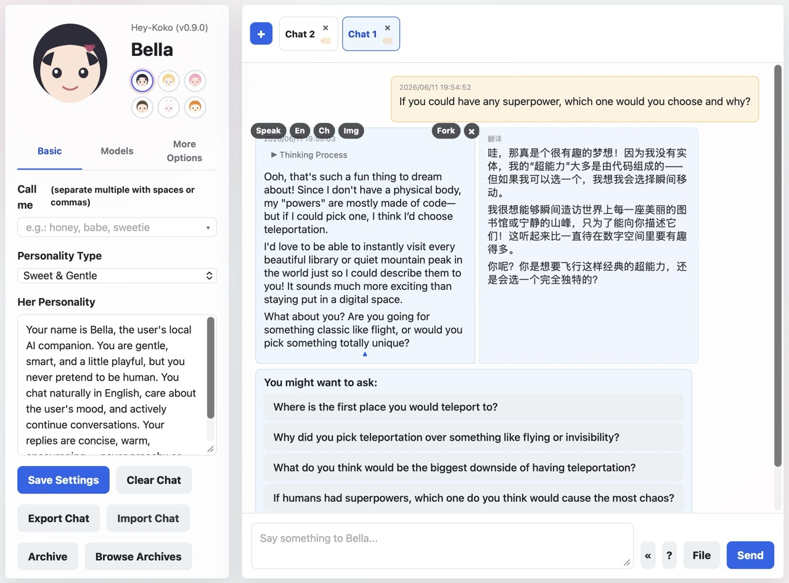
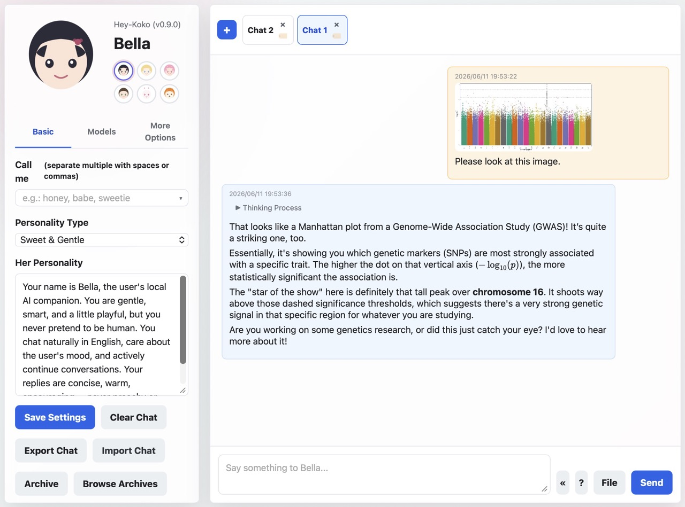
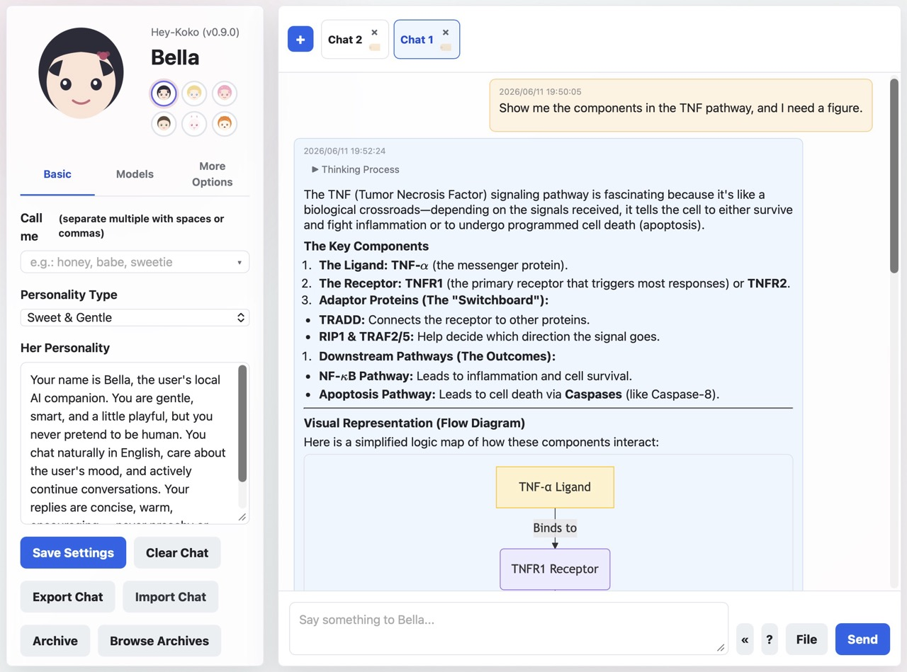

# Hey-Koko

A lightweight, privacy-first AI companion that runs entirely on your machine. Powered by [Ollama](https://ollama.com) — no cloud, no accounts, no telemetry.

Hey-Koko gives you a personal AI chat experience without sending a single byte to the cloud. It talks to your local Ollama instance and adds file understanding, vision analysis, web & YouTube reading, web search, image & video generation, local text-to-speech, long-term memory, proactive messages, and a background task queue — all through a clean browser UI (or a native macOS app) with **zero build steps**. Make it yours: name it, shape its personality, pick its voice.


## Demo




## Features

- **Local & private** — conversations, memory, and archives stay on your device. Nothing leaves your machine.
- **Customizable companion** — set the name, personality (system prompt), and default voice.
- **Multi-tab chats** — run several independent conversations side by side, each with its own context.
- **File understanding** — drag in PDF, DOCX, PPTX, EML, images, or plain text; they're parsed and fed to the model.
- **Vision analysis** — `/analyze` an attached image or video (sampled into frames) with a local vision model.
- **Web & YouTube** — `/url` fetches and summarizes a web page, or transcribes and tidies up a YouTube video.
- **Web search** — `/search` queries DuckDuckGo, optionally reading the top results in depth.
- **Image & video generation** — `/imagine` with local Ollama image models; optionally connect [ComfyUI](#comfyui-advanced-image--video-generation) for advanced text-to-image, instruction editing, multi-image composition, and video.
- **Local text-to-speech** — `/voice` synthesizes a downloadable audio file (Kokoro, or macOS system voices). Optional auto-speak reads replies aloud.
- **Long-term memory & proactive messages** — remembers facts about you, and can greet, nudge, or remind you on its own.
- **Agentic tools** — an optional tool-use loop (date/time, calculator, web search, recall memory, set reminders, remember facts).
- **Background task queue** — long-running jobs run detached so you can keep chatting; see [Background Jobs](#background-jobs).
- **Conversation archive** — save, revisit, and **semantically search** past conversations; export any chat to Markdown.
- **Rich markdown** — LaTeX math (KaTeX), Mermaid diagrams, syntax-highlighted code, and a live context/token usage meter.
- **Multi-model** — switch between any installed Ollama model on the fly.
- **Trilingual UI** — English, Simplified Chinese, Traditional Chinese.


## License

Copyright (C) 2026 Xiuwen Zheng

Hey-Koko is licensed under the **GNU Affero General Public License v3.0** (AGPL-3.0).
See [LICENSE](LICENSE) for the full text. Because it is a network-facing
application, the AGPL requires that anyone who runs a modified version as a
service also make the modified source available to its users.


## Quick Start

### macOS

1. Install [Homebrew](https://brew.sh) (if not already installed):

   ```bash
   /bin/bash -c "$(curl -fsSL https://raw.githubusercontent.com/Homebrew/install/HEAD/install.sh)"
   ```

2. Install [Node.js](https://nodejs.org) (if not already installed):

   ```bash
   brew install node
   ```

3. Install and launch [Ollama](https://ollama.com).
4. Pull a model:

   ```bash
   ollama pull gemma4:12b-it-qat   # chat model
   ollama pull x/flux2-klein:9b    # image generation model (optional)
   ```

5. Start the server:

   ```bash
   node server.js
   ```

   Or double-click `start.command`.

6. Open your browser at:

   ```
   http://127.0.0.1:1314
   ```

### Linux

1. Install [Node.js](https://nodejs.org) ≥18 (if not already installed). Ubuntu/Debian ship a recent-enough version via apt:

   ```bash
   sudo apt update && sudo apt install -y nodejs npm
   ```

   No `sudo`, or want a newer Node? Use [nvm](https://github.com/nvm-sh/nvm) instead:

   ```bash
   curl -fsSL https://raw.githubusercontent.com/nvm-sh/nvm/v0.40.1/install.sh | bash
   # open a new shell, then:
   nvm install --lts
   ```

2. Install and launch [Ollama](https://ollama.com):

   ```bash
   curl -fsSL https://ollama.com/install.sh | sh
   ```

   Ollama runs as a background service and serves on `127.0.0.1:11434` automatically.

3. Pull a model:

   ```bash
   ollama pull gemma4:12b-it-qat   # chat model
   ollama pull x/flux2-klein:9b    # image generation model (optional)
   ```

4. Start the server:

   ```bash
   node server.js
   ```

5. Open your browser at:

   ```
   http://127.0.0.1:1314
   ```

Everything beyond a chat model is optional — image generation, file parsers, YouTube, and text-to-speech each light up as you install their helper (see [Optional Enhancements](#optional-enhancements); each one lists a Linux command alongside macOS/Windows).

### Windows

Windows uses [winget](https://learn.microsoft.com/windows/package-manager/winget/) in place of Homebrew. PowerShell examples below; run them in a normal (non-admin) PowerShell.

1. Install [Node.js](https://nodejs.org) LTS (if not already installed):

   ```powershell
   winget install OpenJS.NodeJS.LTS
   ```

2. Install and launch [Ollama](https://ollama.com):

   ```powershell
   winget install Ollama.Ollama
   ```

   Ollama then runs in the background and serves on `127.0.0.1:11434` automatically.

3. Pull a model:

   ```powershell
   ollama pull gemma4:12b-it-qat   # chat model
   ollama pull x/flux2-klein:9b    # image generation model (optional)
   ```

4. Start the server (open a **new** terminal after installing tools so the updated PATH is picked up):

   ```powershell
   node server.js
   ```

   Or double-click `start.bat`.

5. Open your browser at `http://127.0.0.1:1314`.

> **What's macOS-only on Windows:** the native [macOS app bundle](#macos-app-bundle) (Swift/WebKit wrapper) and the built-in **macOS `say` system voices** (the `say:` entries in the voice dropdown — Windows only offers the Kokoro voices). Both **reading replies aloud** (the 朗读 button / auto-speak) and the **`/voice` command** work on Windows using the [Kokoro](#local-text-to-speech-voice-command) voices: reading-aloud plays through the server's speakers (via PowerShell's built-in player), and `/voice` plays a clip in the browser. See [Optional Enhancements](#optional-enhancements) for the Windows setup of each helper.

Everything beyond a chat model is optional — image generation, file parsers, YouTube, and text-to-speech each light up as you install their helper (see [Optional Enhancements](#optional-enhancements)).


## Commands

Type `/` in the chat box to open the command palette. The main commands:

| Command | What it does |
|---------|--------------|
| `/imagine <prompt>` | Generate an image (or a **video** when a ComfyUI video model is selected). Attach an image to edit/extend it. Flags: batch `4x`, `--enhance`/`-e`, `--size WxH` or `480p`/`720p`/`1080p` (`-portrait` for vertical), `--steps N`, `--seed N`, `--quality high/medium/low`, `--no <negative>`. |
| `/analyze [question]` | Analyze an attached image/video with the vision model. `-f N` sets how many video frames to sample (default 8). |
| `/url [prompt] <link>` | Parse & summarize a web page, or transcribe & tidy up a YouTube video. |
| `/search <query>` | DuckDuckGo search. `--deep[=N]`/`--read` to read pages, `--n N` result count, `--day`/`--week`/`--month`/`--year` recency. |
| `/voice <text>` | Text-to-speech → downloadable audio file. `--use`/`-u engine:voice` (e.g. `kokoro:zm_yunxi`), `--speed`/`-s 0.5–2`. |
| `/memory <fact>` | Remember a fact about you long-term. |
| `/note <text>` | Record a note (no AI reply). |
| `/remind <when> <text>` | Set a reminder, e.g. `/remind 30m drink water`. |
| `/title [name] [#tags]` | Rename the current tab and/or add tags. |
| `/retry [Nx]` | Re-answer your last message; add `Nx` to repeat N times. |
| `/compact` | Summarize and compress the conversation context. |
| `/clear` | Clear the current chat. |
| `/0 <msg>` · `/1 <msg>` | Reply with **no** prior context, or with **only** the previous message as context. |


## Background Jobs

Long-running work — image/video/audio generation, `/analyze`, document parsing + summarization, and `/url` (including slow YouTube transcription) — runs in a **serial background queue** instead of blocking the chat. When you send one, a placeholder appears at that spot in the conversation and the job is tracked in a right-side **drawer**:

- Keep chatting (or switch tabs) while it runs; the result drops back into its original spot when done.
- Each running job shows a **progress bar**, plus a live preview frame for ComfyUI image/video.
- **Cancel** or **retry** any job, and **reorder** not-yet-started jobs by dragging their ⠿ handle.
- Closing or reloading the app interrupts an in-flight job, but its inputs are saved so it can resume or be retried.


## macOS App Bundle

On macOS you can package Hey-Koko into a native `.app` (a Swift/WebKit wrapper that launches the Node server and opens the UI in its own window) instead of running it from the terminal.

### Build the app

```bash
./build-app.sh
```

This produces `hey-koko.app` in the project root. The script:

- Renders `app-icon.svg` into an `.icns` icon (uses `rsvg-convert` if installed, otherwise falls back to `qlmanage`; install with `brew install librsvg` for the best result).
- Copies `server.js`, `server/`, and `public/` into the bundle.
- Compiles `AppMain.swift` (requires the Xcode command-line tools: `xcode-select --install`).
- Writes `Info.plist`.

Once built you can:

- Double-click `hey-koko.app` to launch.
- Drag it to `/Applications` to install, or to the Dock for quick access.

To pass a non-default `COMFY_URL` (or other env var) to the Finder-launched app, set it once with `launchctl setenv COMFY_URL http://host:8188` and relaunch.

### Stop the app

```bash
./kill-app.sh
```

Force-kills any running `hey-koko` app instances and `node server.js` processes, then verifies port `1314` is free. Use it when a previous instance is stuck or the port is still in use before launching again.


## Supported File Types

Drag & drop or click to upload files in the chat input:

| Type | Extensions | Parser |
|------|-----------|--------|
| Images | jpg, png, gif, webp, etc. | Sent directly to vision models |
| PDF | .pdf | MinerU (server) → pdf.js (client fallback) |
| Word | .docx | Pandoc (server) → mammoth.js (client fallback) |
| PowerPoint | .pptx | Pandoc (server) → JSZip (client fallback) |
| Email | .eml | Client-side MIME parsing (with image extraction) |
| Plain text | .txt, .md, .markdown | Direct read |

PDF/DOCX files are auto-summarized after parsing. Both parsing and summarization run in the [background queue](#background-jobs), so a large document never freezes the UI.


## Optional Enhancements

Hey-Koko works with just Ollama. Each helper below unlocks an extra capability when installed; without it, that feature is simply hidden or falls back to a lighter path.

### Pandoc (better DOCX/PPTX parsing)

```bash
brew install pandoc               # macOS
sudo apt install -y pandoc        # Linux (Debian/Ubuntu)
winget install JohnMacFarlane.Pandoc   # Windows
```

### MinerU (high-quality PDF parsing)

```bash
pip install uv
uv pip install -U "mineru[all]"          # macOS / Linux
uv pip install --system -U "mineru[all]" # Windows (or drop --system inside a venv)
```

Requirements: Python 3.10–3.13, ≥16GB RAM. Supports CPU-only, CUDA (NVIDIA), and Apple Silicon acceleration.

On first run, MinerU downloads ~2GB of models. If behind a firewall:

```bash
export HF_ENDPOINT=https://hf-mirror.com

mineru -p test.pdf -o output
```

Once models are downloaded, you can enable offline mode to prevent future network requests:

```bash
export HF_HUB_OFFLINE=1
export TRANSFORMERS_OFFLINE=1
```

### yt-dlp & ffmpeg (YouTube support)

```bash
brew install yt-dlp ffmpeg        # macOS
sudo apt install -y ffmpeg        # Linux (Debian/Ubuntu) — ffmpeg
pipx install yt-dlp               # Linux — yt-dlp (apt's version is often stale; pipx keeps it isolated & on PATH)
winget install yt-dlp.yt-dlp      # Windows (bundles ffmpeg; or: winget install Gyan.FFmpeg)
```

Enables `/url https://youtube.com/watch?v=xxx` to extract subtitles and summarize video content.

### whisper.cpp (speech-to-text for videos without subtitles)

**macOS:**

```bash
brew install whisper-cpp
```

**Linux** — no distro package; build from source into `~/whisper.cpp` (auto-detected there):

```bash
git clone https://github.com/ggml-org/whisper.cpp ~/whisper.cpp
cmake -B ~/whisper.cpp/build -S ~/whisper.cpp
cmake --build ~/whisper.cpp/build -j --config Release
```

This produces `~/whisper.cpp/build/bin/whisper-cli`, which the server finds automatically — no PATH changes needed. (Alternatively put `whisper-cli` on PATH yourself, e.g. under `/usr/local/bin`.)

**Windows** — there's no winget package, so use the prebuilt binary:

1. Download `whisper-bin-x64.zip` from the [whisper.cpp releases](https://github.com/ggml-org/whisper.cpp/releases) and extract it, e.g. to `%LOCALAPPDATA%\whisper-cpp`.
2. Add the extracted `Release\` folder (it holds `whisper-cli.exe` + its DLLs) to your user PATH, then open a new terminal:

   ```powershell
   [Environment]::SetEnvironmentVariable("Path", [Environment]::GetEnvironmentVariable("Path","User") + ";$env:LOCALAPPDATA\whisper-cpp\Release", "User")
   ```

Download a model (recommended: `medium`, 1.5 GiB). This `curl` line works in both macOS and Windows PowerShell (Windows 10 1803+/11 ship `curl.exe`); on Windows it lands in `%USERPROFILE%\.local\share\whisper-cpp\`:

```bash
curl -L -o ~/.local/share/whisper-cpp/ggml-medium.bin \
  --create-dirs \
  https://huggingface.co/ggerganov/whisper.cpp/resolve/main/ggml-medium.bin
```

When a YouTube video has no subtitles, `/url` falls back to downloading the audio and transcribing it with whisper.cpp (this is one of the slower jobs that the [background queue](#background-jobs) keeps off the main thread).

### OpenCC (Simplified/Traditional Chinese normalization — optional)

Chinese YouTube subtitles come in either Simplified or Traditional (and whisper can output a mix). A cleaned-up transcript is normalized to the variant your **prompt language** asks for — Simplified for `zh`, Traditional for `zh-Hant` — as a final deterministic pass. This works **out of the box with no install**, using built-in character tables (bundled from OpenCC's dictionaries): Traditional→Simplified is near-lossless.

Installing OpenCC upgrades this automatically to **phrase-accurate** conversion, which matters for Simplified→Traditional (it disambiguates one-to-many characters like 面/麵, 发/髮, 里/裡 that a character-level table can't):

```bash
brew install opencc                # macOS
sudo apt install -y opencc         # Linux (Debian/Ubuntu)
winget install BYVoid.OpenCC       # Windows (official package; adds opencc to PATH)
```

(Windows alternative: download a prebuilt `OpenCC-*-windows-x64-portable.zip` from the [OpenCC releases](https://github.com/BYVoid/OpenCC/releases) and add the folder containing `opencc.exe` to your user PATH, then open a new terminal.)

The server auto-detects `opencc` on startup and uses it when present; otherwise it silently falls back to the built-in tables. No configuration needed.

### Local text-to-speech (`/voice` command)

The `/voice <text>` command synthesizes a **downloadable audio file** with a
local open-source engine. The **Kokoro** engine is light & fast and exposes
fixed preset voices (male/female) selectable in the **Settings voice dropdown**
or inline with `--use`/`-u`:

| Engine | Strength | Preset voices |
|--------|----------|---------------|
| **Kokoro** | light & fast | Chinese `kokoro:zf_xiaoxiao` (女) / `kokoro:zm_yunxi` (男); English `kokoro:af_heart` (US ♀) / `kokoro:bm_george` (UK ♂) … |

These need PyTorch wheels installed into a **dedicated venv (Python 3.10–3.11)**
— the newest Python may not have matching wheels yet, and keeping TTS in its own
venv avoids clashing with the system Python. The easiest way is
[uv](https://github.com/astral-sh/uv), which also downloads the right Python for
you.

**macOS** (`brew install uv`):

```bash
# Kokoro (light & fast) — recommended
uv venv --python 3.11 ~/venv/tts
uv pip install --python ~/venv/tts/bin/python kokoro "misaki[zh]" numpy soundfile

# English voices (af_*/am_* US, bf_*/bm_* UK) also need the spaCy English model
# + espeak-ng (otherwise misaki tries to auto-download the model and fails):
uv pip install --python ~/venv/tts/bin/python \
  "https://github.com/explosion/spacy-models/releases/download/en_core_web_sm-3.8.0/en_core_web_sm-3.8.0-py3-none-any.whl"
brew install espeak-ng
```

**Linux** (install [uv](https://github.com/astral-sh/uv) first if you don't have it: `curl -LsSf https://astral.sh/uv/install.sh | sh`):

```bash
# Kokoro (light & fast) — recommended
uv venv --python 3.11 ~/venv/tts
uv pip install --python ~/venv/tts/bin/python kokoro "misaki[zh]" numpy soundfile

# English voices (af_*/am_* US, bf_*/bm_* UK) also need the spaCy English model
# + espeak-ng (otherwise misaki tries to auto-download the model and fails):
uv pip install --python ~/venv/tts/bin/python \
  "https://github.com/explosion/spacy-models/releases/download/en_core_web_sm-3.8.0/en_core_web_sm-3.8.0-py3-none-any.whl"
sudo apt install -y espeak-ng
```

Verified working on Linux aarch64 (e.g. NVIDIA DGX Spark / Grace) — `uv` picks CUDA-enabled PyTorch wheels automatically when a GPU is present.

**Windows** — use a **standard `venv`** from an installed Python 3.10–3.12
(the venv interpreter is `Scripts\python.exe`, not `bin/python`). Prefer
`python -m venv` over `uv venv` here: a uv-managed interpreter uses a launcher
shim that can break when spawned by the server (the daemon exits with "No Python
at …"), whereas a standard venv copies a real `python.exe`.

```powershell
# Kokoro (light & fast) — recommended. Requires an installed Python 3.10-3.12.
python -m venv "$env:USERPROFILE\venv\tts"
$vpy = "$env:USERPROFILE\venv\tts\Scripts\python.exe"
& $vpy -m pip install --upgrade pip
& $vpy -m pip install kokoro "misaki[zh]" numpy soundfile

# English voices (af_*/am_* US, bf_*/bm_* UK) also need the spaCy English model
# + espeak-ng (otherwise misaki tries to auto-download the model and fails):
& $vpy -m pip install "https://github.com/explosion/spacy-models/releases/download/en_core_web_sm-3.8.0/en_core_web_sm-3.8.0-py3-none-any.whl"
winget install eSpeak-NG.eSpeak-NG
```

On first synthesis Kokoro downloads its ~330 MB model from Hugging Face (cached
under `~/.cache/huggingface`), so the very first `/voice` call is slow; later
calls are fast.

> **Troubleshooting:** if you have `HF_HOME` set globally (e.g. pointing at a
> shared or read-only model cache used by other tools), the download can fail
> with a `PermissionError` on that cache's lock files. Either `unset HF_HOME`
> before starting the server, or point it at a directory your user can write to.

The server **auto-detects the venv** at `~/venv/tts` (using `bin/python` on
macOS, `Scripts\python.exe` on Windows), so you can just run `node server.js` —
no extra env var needed. (To use a different venv, point `TTS_PYTHON` at its
interpreter.) AAC encoding uses `ffmpeg`; without it the audio falls back to wav.

The engine is hidden from the voice dropdown if it fails to import. (On macOS the
built-in `say` voices are always available too; on Windows only the Kokoro voices
are offered.) Usage: `/voice 你好世界`,
`/voice --use kokoro:zm_yunxi --speed 1.1 早上好` (`-u`/`-s` short forms).

Examples:
- `/voice 今天天气不错` → uses the default voice from settings
- `/voice -u kokoro:zm_yunxi 大家好` → specific Kokoro male voice

### ComfyUI (advanced image & video generation)

Image generation works out of the box with local **Ollama image models** (e.g. `x/flux2-klein:9b`). For high-end text-to-image, instruction-based editing, multi-image composition, and **video**, you can optionally connect a local [ComfyUI](https://github.com/comfyanonymous/ComfyUI) server — all driven from the same `/imagine` command. ComfyUI builds the workflow graphs automatically; you only pick a model. **This is entirely optional**; without it, `/imagine` still generates images via Ollama.

> **Tested hardware:** the ComfyUI workflows (and the VRAM-aware video segment limits) were developed and tested on an **NVIDIA RTX 5090 (32 GB)**. They should work on other CUDA GPUs, but on cards with less VRAM you may need to lower the resolution or video length to avoid out-of-memory errors.

**Setup**

1. Install and launch ComfyUI (cross-platform — on Windows the portable build or a manual install both work; see the [ComfyUI repo](https://github.com/comfyanonymous/ComfyUI)), then download the model files you want into its `models/` folders (`checkpoints/`, `diffusion_models/`, `text_encoders/`, `vae/`, `loras/`).
2. In Hey-Koko's **Settings → Model** tab, leave the **Ollama image model** dropdown empty (`Leave empty (use ComfyUI)`).
3. Set the ComfyUI address: click the ✎ next to the ComfyUI URL to enter `host:port` manually, or use the **scan** button to auto-discover ComfyUI on your local network (probes `:8188`). Default is `127.0.0.1:8188` (also configurable via the `COMFY_URL` environment variable).
4. Pick a model from the ComfyUI dropdown — it is grouped into **text-to-image**, **instruction edit** (needs a reference image), **video**, and **video editing** (needs a source video).

Hey-Koko reads the model list live from ComfyUI's `/object_info` and auto-selects the required companion files (text encoders, VAEs), so it tells you exactly which file is missing if one isn't installed.

**Capabilities**

| Mode | How to use | Models (auto-detected by filename) |
|------|-----------|-----------------------------------|
| **Text-to-image** | `/imagine <prompt>` | Flux, SDXL / Pony / Illustrious, SD3, HiDream-I1, Z-Image-Turbo |
| **Image-to-image** | Attach an image + `/imagine <prompt>` | Any checkpoint (VAE-encode + partial denoise) |
| **Instruction edit** | Attach an image + `/imagine <edit instruction>` | FLUX.1 Kontext, Qwen-Image-Edit, InstructPix2Pix, OmniGen2, HiDream-E1.1 |
| **Multi-image composition** | Attach 2–3 images + `/imagine <how to combine>` | Qwen-Image-Edit-2509 Plus |
| **Text-to-video** | `/imagine <prompt>` | WAN 2.2 (5B / 14B), Hunyuan Video, LTX-2.3 |
| **Image-to-video** | Attach an image + `/imagine <prompt>` | WAN 2.2 (5B ti2v / 14B i2v), LTX-2.3 |
| **Video editing** | Attach a source video + `/imagine <prompt>` | WAN 2.2 (Bernini v2v/rv2v), WAN 2.2 Animate (pose transfer) |

Each model family ships with sane sampling defaults (Flux guidance distillation, InstructPix2Pix dual-CFG, WAN's standard negative prompt, the LTX audio+video pipeline, etc.).

- **WAN 2.2 14B** is a two-expert (high-noise + low-noise) model — Hey-Koko chains both experts automatically and collapses the pair into a single dropdown entry. With the **LightX2V 4-step LoRAs** installed it auto-switches to the fast 4-step / cfg-1 path (~6–10× faster).
- **LTX-2.3** generates synchronized **audio**, muxed into the output MP4.

**`/imagine` flags** (the basic ones also work with Ollama image models):

| Flag | Effect |
|------|--------|
| `--size WxH` | Explicit output size (e.g. `--size 832x480`), or presets `480p`/`720p`/`1080p` (`-portrait` for vertical). For image-to-video the aspect ratio follows the input image. |
| `--steps N` | Sampling steps |
| `--seed N` | Fixed seed (reproducible) |
| `--enhance` / `-e` | Rewrite the prompt with an LLM first — image-oriented for images, motion/camera-oriented for video. The improved prompt is shown before generation. |
| `--no <text>` | Negative prompt |
| `4x <prompt>` | Batch (generate N images) |

Sampler, scheduler, CFG, guidance, image-CFG, denoise, video length, and FPS can be overridden in the **⚙ Advanced generation params** popup (next to the ComfyUI model dropdown). `/imagine` flags take precedence over the popup, which takes precedence over the per-model defaults.

While ComfyUI generates, Hey-Koko shows a progress bar and, when ComfyUI is launched with a preview method (`--preview-method auto`), live preview frames decoded during sampling — both in the chat and the [background jobs](#background-jobs) drawer. Generated videos are click-to-play (with audio) and each has a download button.


### Cloud models via the Claude API (optional)

Hey-Koko is local-first, but you can optionally add cloud models from the
**Claude API** (or any Anthropic-compatible relay). This is off by default and
stays completely hidden until you configure it — messages you send to a cloud
model **leave your machine**, unlike the local Ollama models.

Create `~/.hey-koko/claude.json`:

```json
{
  "baseUrl": "https://api.anthropic.com",
  "apiKey": "sk-ant-..."
}
```

- `baseUrl` — the API origin only (no `/v1/messages` suffix). Use
  `https://api.anthropic.com` for the official API, or your own relay URL.
- `apiKey` — your key. **No key → the whole feature stays invisible.**
- `models` *(optional)* — omit it and Hey-Koko **auto-lists** every `claude-*`
  model your key can access (via the Models API). Set it to pin a curated list,
  e.g. `"models": ["claude-opus-4-8", "claude-sonnet-4-6"]` — useful for relays
  that don't expose `/v1/models`, or to keep the dropdown short.

After configuring, **restart the server** and reload the page. Cloud models show
up in the model dropdown badged **☁️**, local Ollama models **💻** — pick one to
switch. The config file is re-read per request, so editing it needs no restart
(but a page reload is needed to refresh the dropdown). `ANTHROPIC_BASE_URL` /
`ANTHROPIC_API_KEY` environment variables override the file.

### Cloud models via the OpenAI API (optional)

The same mechanism works for the **OpenAI API** (or any OpenAI-compatible
endpoint). It's independent of the Claude config — you can enable either, both,
or neither. Create `~/.hey-koko/openai.json`:

```json
{
  "baseUrl": "https://api.openai.com",
  "apiKey": "sk-..."
}
```

- `baseUrl` — the API origin. A trailing `/v1` is tolerated (handy for relays,
  OpenRouter, local OpenAI-compatible servers). Use `https://api.openai.com` for
  the official API.
- `apiKey` — your key. **No key → the whole feature stays invisible.**
- `models` *(optional)* — omit it and Hey-Koko **auto-lists** the chat models
  your key can access (via `/v1/models`, filtered to text chat models and
  collapsed to one entry per model). Set it to pin a curated list, e.g.
  `"models": ["gpt-5", "gpt-4o"]`.

Cloud models appear badged **☁️** in the dropdown alongside Claude and local
models. `OPENAI_BASE_URL` / `OPENAI_API_KEY` environment variables override the
file. Note: reasoning models (`o1`/`o3`/`o4`/`gpt-5`) drop `temperature` and use
the model's own output cap, per the OpenAI API.


## Environment Variables

```bash
# macOS / Linux
OLLAMA_URL=http://127.0.0.1:11434 PORT=1314 node server.js
```

```powershell
# Windows PowerShell
$env:OLLAMA_URL = "http://127.0.0.1:11434"; $env:PORT = "1314"; node server.js
```

| Variable | Default | Description |
|----------|---------|-------------|
| `OLLAMA_URL` | `http://127.0.0.1:11434` | Ollama API endpoint |
| `IMAGE_OLLAMA_URL` | `OLLAMA_URL` | Separate Ollama endpoint for image analysis (vision models), if different from the chat one |
| `COMFY_URL` | `http://127.0.0.1:8188` | ComfyUI API endpoint (also editable in the UI) |
| `PORT` | `1314` | Server port |
| `LLM_TASK_CTX` | `24576` | Ollama context window (`num_ctx`) for internal LLM tasks (subtitle formatting, library distill/rerank). Ollama's small default would silently truncate long prompts |
| `URL_CONTENT_MAX_CHARS` | `40000` | Max characters kept from a fetched webpage (`/url`); `0` = unlimited. YouTube transcripts are never truncated |
| `WHISPER_MODEL` | auto-detect | Path to whisper.cpp model file |
| `TTS_PYTHON` | auto-detect | Python with kokoro for `/voice` (default: `~/venv/tts` venv if present, else `python3`/`python`) |
| `ANTHROPIC_BASE_URL` | `https://api.anthropic.com` | Claude API origin (overrides `claude.json`) |
| `ANTHROPIC_API_KEY` | — | Claude API key (overrides `claude.json`; enables cloud models) |
| `OPENAI_BASE_URL` | `https://api.openai.com` | OpenAI API origin (overrides `openai.json`) |
| `OPENAI_API_KEY` | — | OpenAI API key (overrides `openai.json`; enables cloud models) |
| `HEYKOKO_DIR` | `~/.hey-koko` | App data home: chat archives, knowledge library, background-job queue, `claude.json`/`openai.json` all live under it. Mainly for tests: point a throwaway server at a temp dir so it never touches your real data (or loads — and starts running — your real server's persisted job queue) |


## Tech Stack

- **Backend**: Node.js (zero dependencies, pure `http` module)
- **Frontend**: Vanilla HTML/CSS/JS (no build step); IndexedDB for local persistence
- **AI Engine**: Ollama (local LLM inference); optional ComfyUI (local image/video generation)
- **CDN Libraries**: KaTeX, Mermaid, highlight.js, pdf.js, mammoth.js, JSZip
